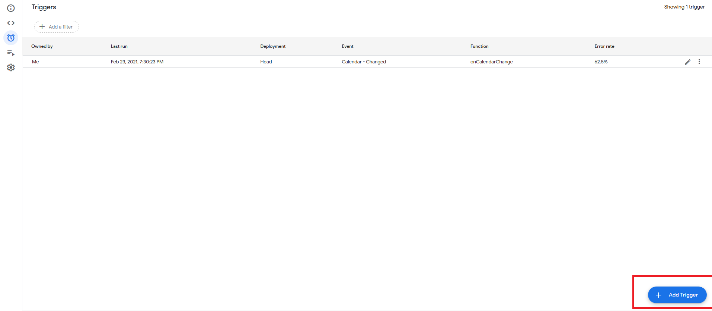
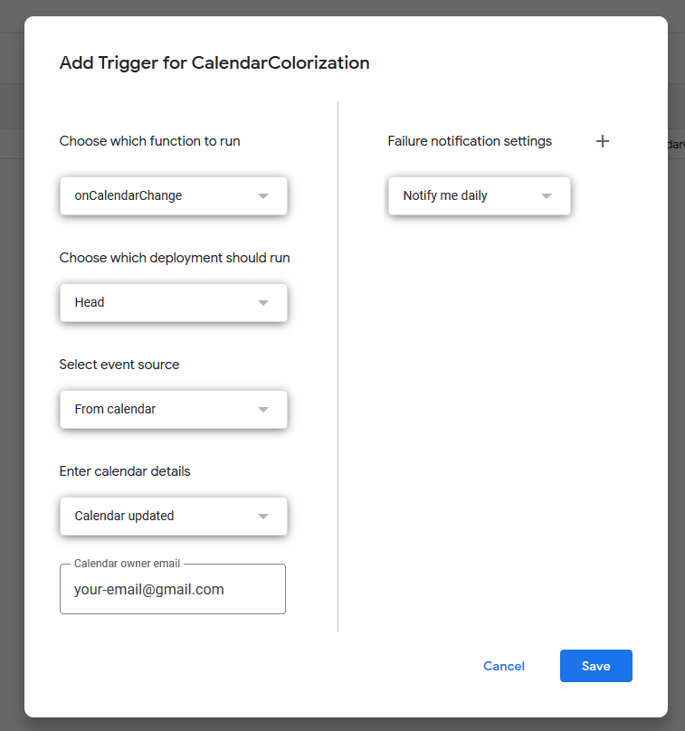

# CalendarColorization
Google Script to colorize calendar event dynamically with the guest list

## Setup Script

First you can change the setup fonction to fit your needs. You can put an email, a color and a priority. You can add rows in the setup function.

Secondly you need to create a trigger with the function onCalendarChange : 

When the trigger is created the script is on and you can create a new calendar event that will modify automatically your agenda.

## Troubleshooting

* Same priority aren't really handled. It will take the first entry with higher priority found in the setup.
* Colorization only work with the appscript colorization Enum.